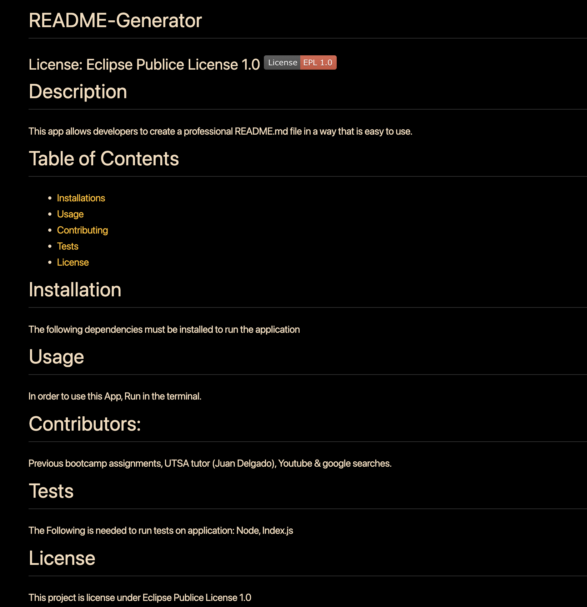

# README GENERATOR APPLICATION 
### Jayné M. Valverde

### **_[LINK TO WALKTHROUGH VIDEO](https://youtu.be/5fZuztfderE)_**

## Table of Contents
* [User Story](#user-story)
* [README Preview](#readmemd-preview)
* [Resources](#resources)

## User Story : 
As a developer, I want to generate a high-quality '**README.md**' file using a Node.js-based tool. This tool should simplify the process of creating a well-structured and informative '**README.md**' file. Here is a *User Story* describing the functionality of my application:

* As a user I want to run the '**README.md**' generater using *Node.js* on my terminal, within my local machine.  

* When I run the generator, I want it to prompt for essential project information, such as the *Project Title, description, Installation instruciton, Useage*, and all other relevant information. 

* Once I have provided all the necessary project information, I want the generator to create a '**README.md**' file in the current directory. 

* The generated '**README.md**' file should container a formatted template with the project information inputed by prompted questions. 

* I want the generator to include Section Headers and formatting to improve readabilities and organization. 

* The generator should also include a license section where I can choose a license for my project. It should provide a list of commonly used liceenses and allow me to select one. 

* After generating this '**README.md**' file, I want the terminal to display a success message, notifying that the file was created. 

## README.MD Preview :

## Resources :

**Juan Delgado**:  
He was my tutor this week and he helped me figure out the functionality for licenese and badge display. I will be booking another appointment with him to help me futher my understanding. 

**[Youtube walk throughs](youtube.com)**:
I used quite a few youtube searches and found that lots of other students uploaded their README generator videos. I looked through some and their explinations helped me through this project immensely. 

